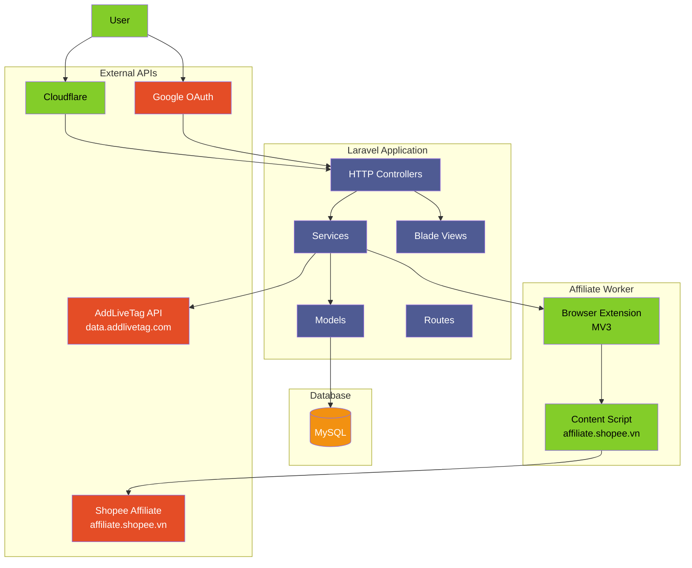
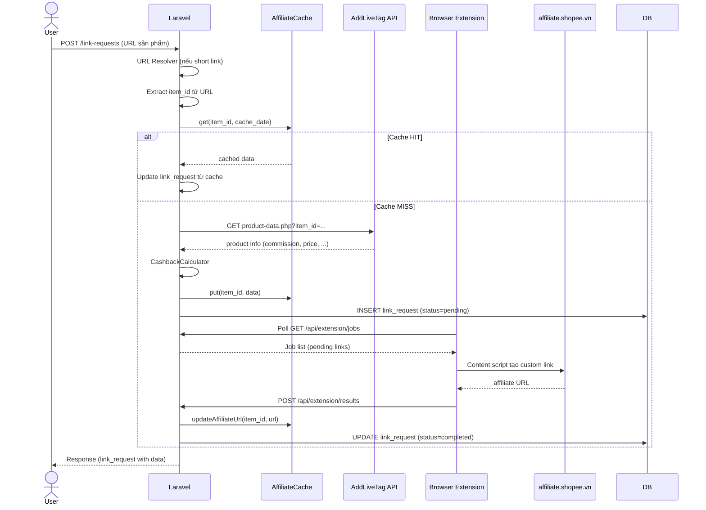

# Kiến trúc hệ thống

## Mục tiêu dự án

Website **hoantien.xyz** — Người dùng dán link sản phẩm Shopee → Hệ thống tạo affiliate link → Người dùng mua hàng qua link → Nhận hoàn tiền (cashback).

## Luồng nghiệp vụ

```
User
  │
  ▼ Nhập link sản phẩm (VD: https://shopee.vn/...)
  │
  ▼ URL Resolver — Rút gọn short link (s.shopee.vn → full URL)
  │
  ▼ Cache lookup — Kiểm tra affiliate_cache (theo item_id + ngày)
  │
  ▼ Product Data — Gọi API AddLiveTag lấy thông tin sản phẩm
  │
  ▼ Cashback Calculator — Tính hoa hồng dựa trên commission rate
  │
  ▼ Affiliate Link Generation — Tạo link affiliate qua Worker/Extension
  │
  ▼ Cache save — Lưu kết quả vào affiliate_cache
  │
  ▼ Dashboard — Hiển thị kết quả cho user (product info + cashback + link)
```

### Giải thích từng bước

1. **User nhập link**: User dán URL sản phẩm Shopee vào form trên Dashboard.
2. **URL Resolver**: Nếu URL là short link (s.shopee.vn, vn.shp.ee), hệ thống follow redirect để lấy URL đầy đủ. Có retry + timing log.
3. **Cache lookup**: Kiểm tra `affiliate_cache` theo `item_id` và `cache_date` (hôm nay). Nếu đã cache → dùng luôn, không cần gọi API hay Worker.
4. **Product Data**: Gọi API `data.addlivetag.com/product-data/product-data.php` để lấy thông tin sản phẩm (giá, commission, tên, hình ảnh, rating...).
5. **Cashback Calculator**: Tính `user_estimated_cashback` dựa trên commission thực tế × cashback_rate (50%/60%/70%) sau khi trừ 10% thuế.
6. **Affiliate Link Generation**: Với Shopee, link được tạo bởi Browser Extension (content script inject vào trang affiliate.shopee.vn). Các platform khác fake link.
7. **Cache save**: Lưu toàn bộ thông tin sản phẩm + cashback + affiliate_url vào `affiliate_cache`.
8. **Dashboard**: Hiển thị link affiliate, cashback ước tính, thông tin sản phẩm.

## Kiến trúc tổng thể



## Luồng request chi tiết



## Các thành phần chính

### 1. Laravel (PHP 8.2 / Laravel 12)
- Web server: Apache (XAMPP)
- Session driver: Database
- Cache driver: Database
- Queue driver: Database (không dùng queue thực tế — polling qua Extension)

### 2. Affiliate Worker (Node.js/Express)
- Port: 3001
- Express HTTP API
- Browser Extension (MV3) poll Laravel API để lấy job
- Content Script thao tác trực tiếp trên trang affiliate.shopee.vn
- Playwright/CDP: **DEAD** — Shopee phát hiện DevTools Protocol

### 3. Database (MySQL)
- 15 tables: users, sessions, cache, jobs, link_requests, affiliate_cache, ...

### 4. External APIs
- **AddLiveTag API**: Lấy thông tin sản phẩm Shopee
- **Google OAuth**: Đăng nhập
- **Cloudflare**: CDN, SSL, Tunnel

### 5. Cloudflare
- Proxy/DDoS protection
- SSL termination (origin chỉ nhận HTTP từ Cloudflare)
- Tunnel (cloudflared) kết nối origin server đến Cloudflare
- Cache: DYNAMIC (không cache trang PHP)
