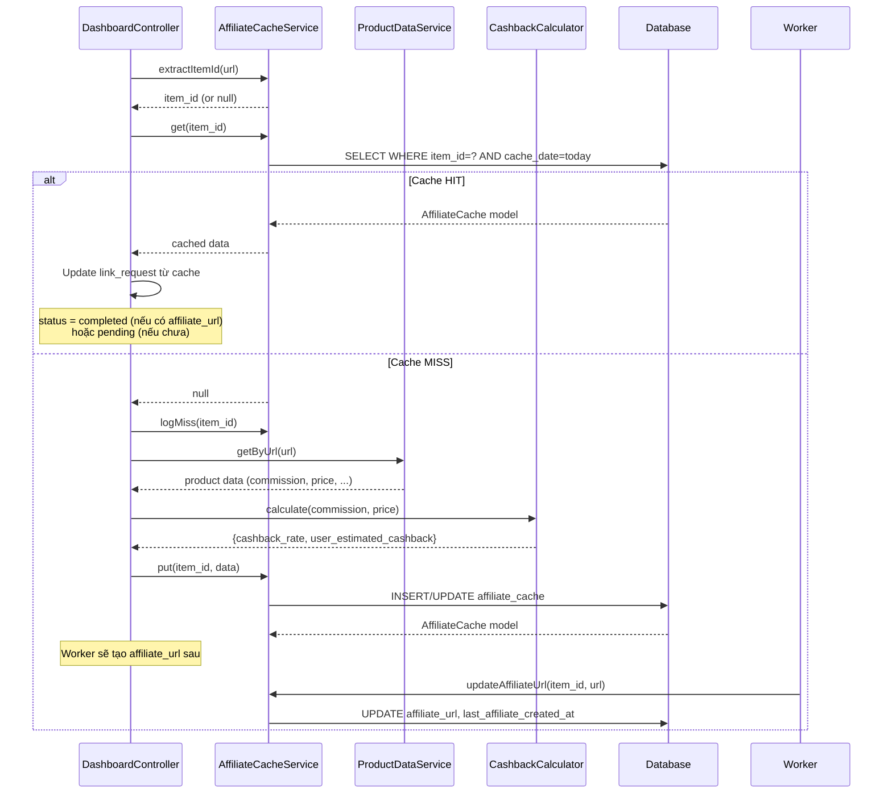
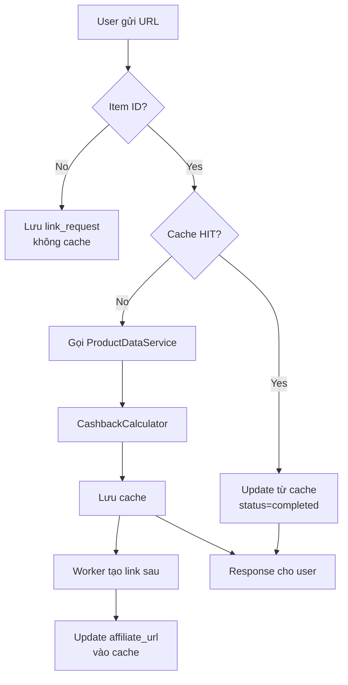

# Cache

## Tổng quan

Hệ thống cache dùng để tránh gọi API AddLiveTag và Worker nhiều lần cho cùng một sản phẩm trong cùng ngày.

## Cache layer

### AffiliateCache (Database)

**Table**: `affiliate_cache`

**Cache key**: `(item_id, cache_date)`

**Cache policy**:
- Mỗi item_id chỉ được cache 1 lần/ngày (theo giờ Việt Nam)
- cache_date = `now('Asia/Ho_Chi_Minh')->toDateString()`
- Hết ngày → cache miss
- Cache chứa: product info, commission, cashback, affiliate_url

**Lưu ý**: Cache dùng database, không dùng Redis/memcached.

### Cache flow



### Cache Hit

```php
// DashboardController.php
$cached = $itemId ? $this->cacheService->get($itemId) : null;

if ($cached) {
    // Update link_request từ cache
    $link->update([
        'item_id'                => $cached->item_id,
        'estimated_cashback'     => $cached->estimated_cashback,
        'user_estimated_cashback' => $cached->user_estimated_cashback,
        'cashback_rate'          => $cached->cashback_rate,
        'product_name'           => $cached->product_name,
        // ... toàn bộ field
        'affiliate_url'          => $cached->affiliate_url,
        'status'                 => $status, // 'completed' nếu có affiliate_url
    ]);
}
```

### Cache Miss

```php
if ($itemId) {
    $this->cacheService->logMiss($itemId);
}

// Gọi ProductDataService
$productData = $this->productData->getByUrl($resolvedUrl);

if (($productData['success'] ?? false)) {
    $commission = (float) ($productData['commission'] ?? 0);
    $price = (float) ($productData['product_price'] ?? 0);
    $cashback = $this->cashbackCalculator->calculate($commission, $price);

    // Update link_request
    $link->update([...]);

    // Lưu cache
    $this->cacheService->put($resolvedItemId, [...]);
}
```

### Affiliate URL Update

Khi worker (Browser Extension) hoàn thành tạo link, nó gọi:

```
POST /api/extension/results?token=...
→ AffiliateJobController@result
→ cacheService->updateAffiliateUrl(item_id, affiliate_url)
```

```php
// AffiliateCacheService.php
public function updateAffiliateUrl(int $itemId, string $affiliateUrl): void
{
    AffiliateCache::where('item_id', $itemId)
        ->whereDate('cache_date', $this->cacheDate)
        ->update([
            'affiliate_url' => $affiliateUrl,
            'last_affiliate_created_at' => now('Asia/Ho_Chi_Minh'),
        ]);
}
```

### Timing Log

Khi `AFFILIATE_TIMING=true`, các log sau được ghi:

```
[CACHE] item_id=123456 status=HIT cache_date=2026-06-30
[CACHE] item_id=123456 status=MISS cache_date=2026-06-30
[CACHE-Timing] item_id=123456 elapsed_ms=1250
```

## Cache vs không cache



## Laravel Config Cache

```php
// config/cache.php
'default' => env('CACHE_STORE', 'database'),

'stores' => [
    'database' => [
        'driver' => 'database',
        'table' => 'cache',
    ],
],
```

Cache store mặc định là **database** (table `cache`).

## TODO
- [ ] Thêm Redis cache cho product data (24h TTL)
- [ ] Cache warming: pre-cache sản phẩm hot
- [ ] Cache invalidation khi Shopee API thay đổi
- [ ] Cache stats dashboard
