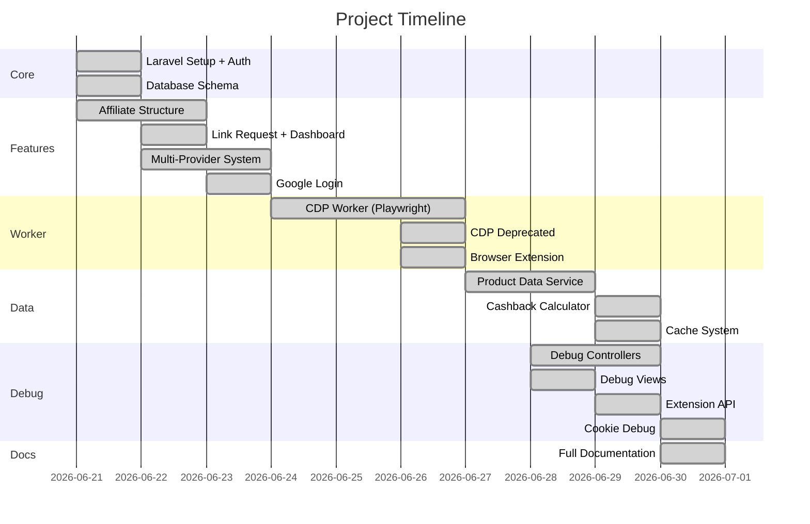

# Lịch sử phát triển

## V1 — Khởi tạo (2026-06-21)

- Laravel 11 project (Laravel Breeze)
- User authentication (email/password)
- Blade templates với Tailwind CSS
- Database migrations: users, sessions, cache, jobs

## V2 — Affiliate Structure (2026-06-21 ~ 2026-06-22)

- Thêm Spatie Permission (roles: Admin, Merchant, Affiliate, Member)
- Thêm bảng: merchants, campaigns, campaign_categories
- Thêm bảng: clicks, purchases (tracking)
- Thêm bảng: transactions, withdrawals (wallet)
- Thêm bảng: settings (dynamic config)
- Thêm referral system (referral_code, referred_by, wallet_balance)
- User model: relationships + scopes

## V3 — Link Request (2026-06-21 ~ 2026-06-22)

- Thêm bảng `link_requests`
- `DashboardController` với form nhập URL
- `DashboardController@store` — xử lý URL
- `detectPlatform()` — phát hiện platform từ URL
- Danh sách recent links + pin link (tối đa 5)

## V4 — Multi-Provider (2026-06-22 ~ 2026-06-26)

- `Platform` enum (Shopee, Lazada, TikTok, ...)
- `AffiliateProviderInterface` contract
- `ProviderFactory` — detect platform + return provider
- `AppServiceProvider` — tag + inject providers
- 8 platform providers (Shopee, Lazada, TikTok, LongChau, Pharmacity, Traveloka, Agoda, Booking)
- `AffiliateService` — facade cho provider system

## V5 — Worker Architecture (2026-06-22 ~ 2026-06-26)

- `AffiliateWorkerClient` — HTTP client gọi Node worker
- `ShopeeProvider` — gọi worker tạo link thật
- Express server (`server.js`) — health check, create-link API
- CDP modules: ChromeManager, AffiliateNavigator, CustomLinkWorker, ...
- Playwright + stealth plugin
- Batch scripts: start-worker, start-chrome-cdp, test-worker

## V6 — Cashback + Product Data (2026-06-26 ~ 2026-06-29)

- `ProductDataService` — gọi AddLiveTag API
- `CashbackCalculator` — tính cashback (50/60/70%)
- `AffiliateCacheService` — cache theo item_id + ngày
- `affiliate_cache` table
- Cập nhật `link_requests` với product data (item_id, product_name, price, commission, ...)
- URL Resolver cho short link Shopee
- Timing log (`AFFILIATE_TIMING`)

## V7 — CDP Deprecated → Browser Extension (2026-06-26)

- Phát hiện Shopee chặn Chrome DevTools Protocol → CAPTCHA
- Chuyển sang Browser Extension (MV3)
- `background.js` — poll API
- `content.js` — inject vào trang affiliate.shopee.vn
- `popup.html/js` — config UI
- `affiliate-worker/server.js` endpoints (deprecated)
- `README.md` + `PROJECT_CONTEXT.md` cập nhật

## V8 — Debug Tools (2026-06-26 ~ 2026-06-29)

- Debug controllers: WorkerController, ShopeeLoginController, ProviderController, PlaywrightController
- Debug views: worker, shopee-login, provider, playwright
- API Extension endpoints: /api/extension/jobs, /api/extension/results
- API LinkRequest endpoint: /api/link-request/{id}

## V9 — Google Login (2026-06-23)

- `GoogleController` — OAuth redirect + callback
- Socialite integration
- `google_id` column trong users table
- Auto-login với remember=true

## V10 — Google OAuth và Session Finalization (2026-06-29 ~ 2026-06-30)

- Google OAuth hoàn thiện
- CSRF + Session config tuning
- `forceScheme('https')` trong AppServiceProvider
- `trustProxies(at: '*')` cho Cloudflare

## V11 — Documentation (2026-06-30)

- Tạo toàn bộ docs/ markdown
- 14 files: ARCHITECTURE, SERVICES, DATABASE, API, WORKER, CACHE, CASHBACK, LOGIN, CONFIG, FILE_REFERENCE, SEQUENCE, TODO, CHANGELOG_AI, FOLDER_STRUCTURE

## Milestones Timeline

## Thống kê (2026-06-30)

| Thành phần | Số lượng |
|-----------|----------|
| PHP Files | ~40 |
| Blade Views | 39 |
| JS Files (affiliate-worker) | 10+ |
| Database Migrations | 22 |
| Database Tables | 15+ |
| Services | 15 |
| Controllers | 20 |
| Models | 11 |
| Config Files | 11 |
