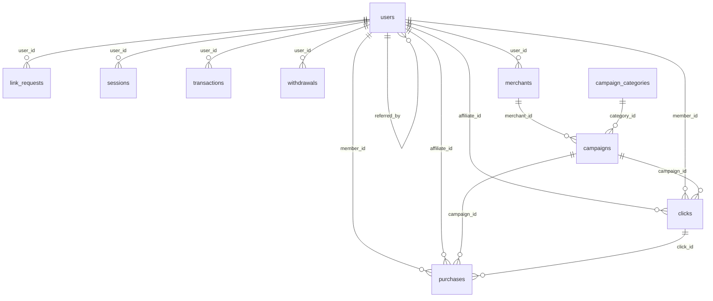

# Database

## Tổng quan

- **Engine**: MySQL
- **Charset**: utf8mb4
- **Collation**: utf8mb4_unicode_ci
- **Migrations**: 22 files
- **Tables**: 15

## Sơ đồ quan hệ



## Danh sách bảng

---

### 1. `users`

**Purpose**: Tài khoản người dùng.

| Column | Type | Constraints | Notes |
|--------|------|-------------|-------|
| id | bigint unsigned | PK, AUTO_INCREMENT | |
| name | varchar(255) | NOT NULL | |
| email | varchar(255) | UNIQUE, NOT NULL | |
| email_verified_at | timestamp | NULL | |
| password | varchar(255) | NOT NULL | Hashed |
| remember_token | varchar(100) | NULL | Remember me |
| referral_code | varchar(12) | UNIQUE, NULL | Mã giới thiệu (8 ký tự, uppercase) |
| referred_by | bigint unsigned | FK→users.id, NULL | Người giới thiệu |
| wallet_balance | decimal(15,2) | DEFAULT 0 | Số dư ví |
| total_earned | decimal(15,2) | DEFAULT 0 | Tổng kiếm được |
| total_withdrawn | decimal(15,2) | DEFAULT 0 | Tổng đã rút |
| phone | varchar(20) | NULL | Số điện thoại |
| avatar | varchar(255) | NULL | URL avatar |
| google_id | varchar(255) | UNIQUE, NULL | ID Google OAuth |
| status | enum('active','suspended') | DEFAULT 'active' | Trạng thái |
| created_at | timestamp | | |
| updated_at | timestamp | | |

**Relationships**:
- `referral_code`: Tự động sinh trong `User::boot()` creating event
- `referred_by`: Self-referencing FK
- `google_id`: Unique để hỗ trợ Google Login

**Indexes**:
- PRIMARY (id)
- UNIQUE (email, referral_code, google_id)

---

### 2. `sessions`

**Purpose**: Laravel session storage (database driver).

| Column | Type | Constraints | Notes |
|--------|------|-------------|-------|
| id | varchar(255) | PK | Session ID |
| user_id | bigint unsigned | NULL, INDEX | Người dùng (nếu đã login) |
| ip_address | varchar(45) | NULL | |
| user_agent | text | NULL | |
| payload | longtext | NOT NULL | Session data (encrypted?) |
| last_activity | int | NOT NULL, INDEX | Unix timestamp |

**Indexes**:
- PRIMARY (id)
- INDEX (user_id, last_activity)

---

### 3. `cache`

**Purpose**: Laravel cache store.

| Column | Type | Constraints | Notes |
|--------|------|-------------|-------|
| key | varchar(255) | PK | Cache key |
| value | mediumtext | NOT NULL | Cached value |
| expiration | int | NOT NULL, INDEX | Unix timestamp |

**Indexes**:
- PRIMARY (key)
- INDEX (expiration)

---

### 4. `cache_locks`

**Purpose**: Cache lock (atomic operations).

| Column | Type | Constraints |
|--------|------|-------------|
| key | varchar(255) | PK |
| owner | varchar(255) | NOT NULL |
| expiration | int | NOT NULL, INDEX |

---

### 5. `jobs`

**Purpose**: Queue jobs (không dùng — queue để trống).

| Column | Type | Constraints |
|--------|------|-------------|
| id | bigint unsigned | PK, AUTO_INCREMENT |
| queue | varchar(255) | NOT NULL, INDEX |
| payload | longtext | NOT NULL |
| attempts | tinyint unsigned | NOT NULL |
| reserved_at | int unsigned | NULL |
| available_at | int unsigned | NOT NULL |
| created_at | int unsigned | NOT NULL |

---

### 6. `password_reset_tokens`

**Purpose**: Reset password tokens.

| Column | Type | Constraints |
|--------|------|-------------|
| email | varchar(255) | PK |
| token | varchar(255) | NOT NULL |
| created_at | timestamp | NULL |

---

### 7. `permissions` / `roles` / `model_has_permissions` / `model_has_roles` / `role_has_permissions`

**Purpose**: Spatie Permission package (RBAC).

**Tables**:
- `permissions`: id, name, guard_name, timestamps
- `roles`: id, name, guard_name, timestamps
- `model_has_permissions`: permission_id, model_type, model_id
- `model_has_roles`: role_id, model_type, model_id
- `role_has_permissions`: permission_id, role_id

**Roles đã tạo**:
- Admin
- Merchant
- Affiliate
- Member

---

### 8. `link_requests`

**Purpose**: Request tạo affiliate link từ user.

| Column | Type | Constraints | Notes |
|--------|------|-------------|-------|
| id | bigint unsigned | PK, AUTO_INCREMENT | |
| user_id | bigint unsigned | FK→users.id, INDEX | |
| item_id | bigint unsigned | NULL, INDEX | Shopee item_id |
| shop_id | bigint unsigned | NULL, INDEX | Shopee shop_id |
| original_url | varchar(2048) | NOT NULL | URL gốc user nhập |
| platform | varchar(50) | NOT NULL, INDEX | Shopee, Lazada, TikTok, ... |
| affiliate_url | varchar(2048) | NULL | Link affiliate đã tạo |
| estimated_cashback | decimal(15,2) | NULL | Commission từ API |
| user_estimated_cashback | decimal(15,2) | NULL | Cashback user nhận |
| cashback_rate | decimal(5,2) | NULL | 0.50, 0.60, 0.70 |
| product_name | varchar(255) | NULL | |
| product_price | bigint unsigned | NULL | |
| product_link | varchar(255) | NULL | |
| seller_commission | bigint unsigned | NULL | |
| shopee_commission | bigint unsigned | NULL | |
| rating | decimal(3,2) | NULL | |
| is_xtra | boolean | DEFAULT false | |
| product_image | varchar(255) | NULL | |
| shop_name | varchar(255) | NULL | |
| sales | int unsigned | NULL | |
| data_source | varchar(255) | NULL | |
| status | enum(...) | DEFAULT 'pending' | pending, processing, completed, rejected |
| notes | text | NULL | |
| is_pinned | boolean | DEFAULT false | |
| pinned_at | timestamp | NULL | |
| created_at | timestamp | | |
| updated_at | timestamp | | |

**Indexes**:
- PRIMARY (id)
- INDEX (user_id, status, platform, is_pinned, item_id, shop_id)

**Accessor**:
- `getShortUrlAttribute()`: Rút gọn affiliate_url → `domain/code`

---

### 9. `affiliate_cache`

**Purpose**: Cache affiliate data theo item_id và ngày.

| Column | Type | Constraints | Notes |
|--------|------|-------------|-------|
| item_id | bigint unsigned | PK | Shopee item_id (không auto increment) |
| cache_date | date | NOT NULL | Ngày cache (Asia/Ho_Chi_Minh) |
| shop_id | bigint unsigned | NULL | |
| product_name | varchar(255) | NULL | |
| product_price | bigint unsigned | NULL | |
| seller_commission | bigint unsigned | NULL | |
| shopee_commission | bigint unsigned | NULL | |
| estimated_cashback | int | NULL | |
| user_estimated_cashback | decimal(15,2) | NULL | |
| cashback_rate | decimal(5,2) | NULL | |
| affiliate_url | varchar(2048) | NULL | |
| last_affiliate_created_at | timestamp | NULL | |
| rating | decimal(3,2) | NULL | |
| sales | int unsigned | NULL | |
| product_image | varchar(255) | NULL | |
| product_link | varchar(255) | NULL | |
| shop_name | varchar(255) | NULL | |
| is_xtra | boolean | DEFAULT false | |
| data_source | varchar(255) | NULL | |
| created_at | timestamp | | |
| updated_at | timestamp | | |

**Đặc điểm**:
- `$incrementing = false` (item_id là PK nhưng không auto increment)
- Composite unique: (item_id + cache_date) qua `updateOrCreate`

---

### 10. `campaign_categories`

**Purpose**: Danh mục chiến dịch affiliate.

| Column | Type | Constraints |
|--------|------|-------------|
| id | bigint unsigned | PK, AUTO_INCREMENT |
| name | varchar(100) | NOT NULL |
| slug | varchar(120) | UNIQUE |
| description | text | NULL |
| icon | varchar(255) | NULL |
| sort_order | int | DEFAULT 0 |
| is_active | boolean | DEFAULT true |
| created_at | timestamp | |
| updated_at | timestamp | |
| deleted_at | timestamp | NULL (soft delete) |

---

### 11. `merchants`

**Purpose**: Người bán / đối tác.

| Column | Type | Constraints |
|--------|------|-------------|
| id | bigint unsigned | PK, AUTO_INCREMENT |
| user_id | bigint unsigned | UNIQUE, FK→users.id |
| store_name | varchar(200) | NOT NULL |
| slug | varchar(255) | UNIQUE |
| website | varchar(255) | NULL |
| description | text | NULL |
| logo | varchar(255) | NULL |
| commission_rate | decimal(5,2) | DEFAULT 15.00 |
| status | enum('pending','active','suspended') | DEFAULT 'pending' |
| timestamps + softDeletes | | |

---

### 12. `campaigns`

**Purpose**: Chiến dịch affiliate marketing.

| Column | Type | Constraints |
|--------|------|-------------|
| id | bigint unsigned | PK, AUTO_INCREMENT |
| merchant_id | bigint unsigned | FK→merchants.id |
| category_id | bigint unsigned | FK→campaign_categories.id, NULL |
| type | enum('store','product') | NOT NULL |
| name | varchar(200) | NOT NULL |
| slug | varchar(255) | UNIQUE |
| description | text | NULL |
| image | varchar(255) | NULL |
| cashback_type | enum('percentage','fixed') | NOT NULL |
| cashback_value | decimal(10,2) | NOT NULL |
| commission_type | enum('percentage','fixed') | NOT NULL |
| commission_value | decimal(10,2) | NOT NULL |
| affiliate_share | decimal(5,2) | DEFAULT 40.00 |
| url | varchar(255) | NOT NULL |
| tracking_url | varchar(255) | NULL |
| start_date | timestamp | NULL |
| end_date | timestamp | NULL |
| is_featured | boolean | DEFAULT false |
| is_verified | boolean | DEFAULT false |
| sort_order | int | DEFAULT 0 |
| status | enum('draft','active','paused','expired') | DEFAULT 'draft' |
| timestamps + softDeletes | | |

**Indexes**: merchant_id, category_id, status, type, is_featured, is_verified

---

### 13. `clicks`

**Purpose**: Click tracking cho campaign.

| Column | Type | Constraints |
|--------|------|-------------|
| id | bigint unsigned | PK, AUTO_INCREMENT |
| campaign_id | bigint unsigned | FK→campaigns.id |
| affiliate_id | bigint unsigned | FK→users.id, NULL |
| member_id | bigint unsigned | FK→users.id, NULL |
| ip_address | varchar(45) | NOT NULL |
| user_agent | text | NOT NULL |
| referrer_url | varchar(255) | NULL |
| clicked_at | timestamp | NOT NULL |
| converted | boolean | DEFAULT false |
| created_at | timestamp | |
| updated_at | timestamp | |

---

### 14. `purchases`

**Purpose**: Giao dịch mua hàng qua affiliate link.

| Column | Type | Constraints |
|--------|------|-------------|
| id | bigint unsigned | PK, AUTO_INCREMENT |
| click_id | bigint unsigned | FK→clicks.id, NULL |
| campaign_id | bigint unsigned | FK→campaigns.id |
| member_id | bigint unsigned | FK→users.id |
| affiliate_id | bigint unsigned | FK→users.id, NULL |
| order_id | varchar(100) | NULL |
| order_amount | decimal(15,2) | NOT NULL |
| cashback_amount | decimal(15,2) | NOT NULL |
| commission_amount | decimal(15,2) | NOT NULL |
| affiliate_commission | decimal(15,2) | DEFAULT 0 |
| status | enum('pending','approved','confirmed','cancelled','refunded') | DEFAULT 'pending' |
| confirmed_at | timestamp | NULL |
| admin_note | text | NULL |
| timestamps + softDeletes | | |

---

### 15. `transactions`

**Purpose**: Lịch sử giao dịch ví.

| Column | Type | Constraints |
|--------|------|-------------|
| id | bigint unsigned | PK, AUTO_INCREMENT |
| user_id | bigint unsigned | FK→users.id |
| type | enum('cashback_earned','commission_earned','withdrawal','referral_bonus','adjustment') | NOT NULL |
| amount | decimal(15,2) | NOT NULL |
| balance_before | decimal(15,2) | NOT NULL |
| balance_after | decimal(15,2) | NOT NULL |
| description | varchar(255) | NULL |
| reference_type | varchar(255) | NULL (morphs) |
| reference_id | bigint unsigned | NULL (morphs) |
| status | enum('pending','completed','cancelled') | DEFAULT 'completed' |
| timestamps + softDeletes | | |

---

### 16. `withdrawals`

**Purpose**: Yêu cầu rút tiền.

| Column | Type | Constraints |
|--------|------|-------------|
| id | bigint unsigned | PK, AUTO_INCREMENT |
| user_id | bigint unsigned | FK→users.id |
| amount | decimal(15,2) | NOT NULL |
| fee | decimal(15,2) | DEFAULT 0 |
| net_amount | decimal(15,2) | NOT NULL |
| payment_method | enum('bank','momo','vnpay') | NOT NULL |
| bank_name | varchar(255) | NULL |
| bank_account | varchar(255) | NULL |
| bank_holder | varchar(255) | NULL |
| admin_note | text | NULL |
| status | enum('pending','processing','completed','rejected') | DEFAULT 'pending' |
| processed_at | timestamp | NULL |
| processed_by | bigint unsigned | FK→users.id, NULL |
| timestamps + softDeletes | | |

---

### 17. `settings`

**Purpose**: Cấu hình động.

| Column | Type | Constraints |
|--------|------|-------------|
| id | bigint unsigned | PK, AUTO_INCREMENT |
| key | varchar(100) | UNIQUE |
| value | text | NULL |
| created_at | timestamp | |
| updated_at | timestamp | |

---

## Luồng dữ liệu chính

```
User nhập URL
  → INSERT link_requests (status=pending)
  
Worker nhận job
  → SELECT link_requests WHERE status=pending
  → Tạo affiliate link
  → UPDATE link_requests SET status=completed, affiliate_url=...
  → UPDATE affiliate_cache SET affiliate_url=...
```

## TODO
- Một số bảng (campaigns, clicks, purchases, merchants, transactions, withdrawals) đã migration nhưng chưa có Controller/Service sử dụng.
