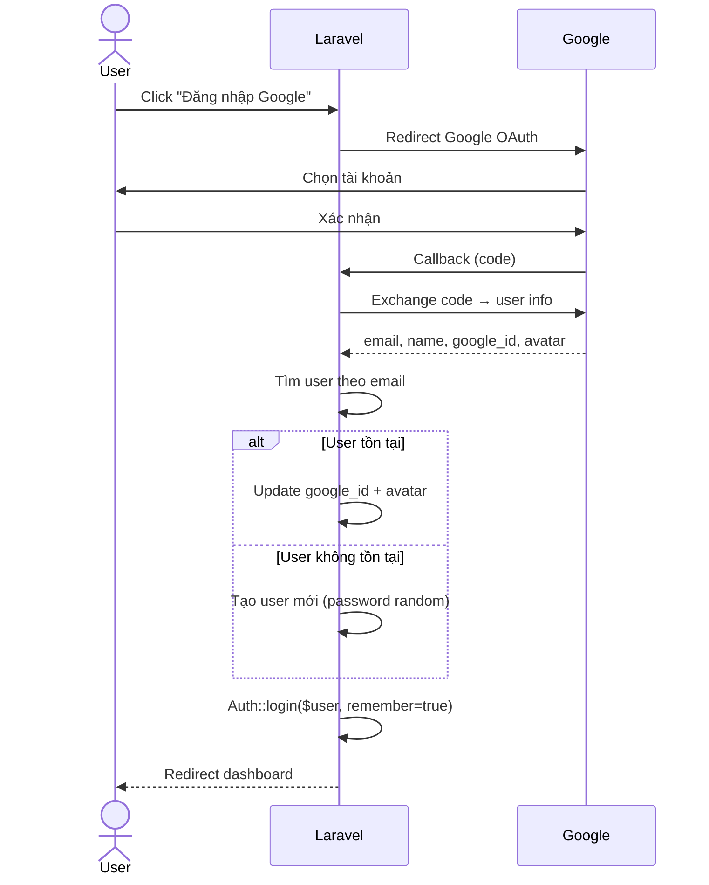

# Login / Authentication

## Tổng quan

Hệ thống hỗ trợ 2 phương thức đăng nhập:
1. **Google OAuth** — Chính (Socialite)
2. **Email + Password** — Dự phòng (Laravel Breeze)

## Google Login

### Flow



### Code

```php
// app/Http/Controllers/Auth/GoogleController.php
public function redirect()
{
    return Socialite::driver('google')->redirect();
}

public function callback()
{
    $googleUser = Socialite::driver('google')->stateless()->user();

    $user = User::where('email', $googleUser->getEmail())->first();

    if ($user) {
        $user->update([
            'google_id' => $googleUser->getId(),
            'avatar' => $googleUser->getAvatar(),
        ]);
    } else {
        $user = User::create([
            'name' => $googleUser->getName(),
            'email' => $googleUser->getEmail(),
            'google_id' => $googleUser->getId(),
            'avatar' => $googleUser->getAvatar(),
            'password' => Hash::make(Str::random(32)),
        ]);
    }

    Auth::login($user, true);  // remember = true
    return redirect()->intended(route('dashboard'));
}
```

### Config

```php
// config/services.php
'google' => [
    'client_id' => env('GOOGLE_CLIENT_ID'),
    'client_secret' => env('GOOGLE_CLIENT_SECRET'),
    'redirect' => env('GOOGLE_REDIRECT_URI'),
],
```

### Routes

```php
// routes/web.php
Route::get('/auth/google', [GoogleController::class, 'redirect'])->name('google.redirect');
Route::get('/auth/google/callback', [GoogleController::class, 'callback'])->name('google.callback');
```

## Email + Password Login (Breeze)

### Flow

```
POST /login
  → AuthenticatedSessionController@store
  → LoginRequest::authenticate()  (validate credentials)
  → session()->regenerate()       (regenerate session ID)
  → redirect()->intended(dashboard)
```

### Code

```php
// app/Http/Controllers/Auth/AuthenticatedSessionController.php
public function store(LoginRequest $request): RedirectResponse
{
    $request->authenticate();
    $request->session()->regenerate();
    return redirect()->intended(route('dashboard', absolute: false));
}
```

## Session

### Laravel Session Config

```php
// config/session.php
'driver' => env('SESSION_DRIVER', 'database'),
'cookie' => env('SESSION_COOKIE', 'hoan-tien-mua-sam-session'),
'path' => env('SESSION_PATH', '/'),
'domain' => env('SESSION_DOMAIN'),      // null → exact hostname
'secure' => env('SESSION_SECURE_COOKIE'), // true
'http_only' => env('SESSION_HTTP_ONLY', true),
'same_site' => env('SESSION_SAME_SITE', 'lax'),
'lifetime' => (int) env('SESSION_LIFETIME', 120), // minutes
```

### .env values

```env
SESSION_DRIVER=database
SESSION_COOKIE=hoan-tien-mua-sam-session
SESSION_PATH=/
SESSION_SECURE_COOKIE=true
SESSION_DOMAIN=null            # → PHP null
SESSION_SAME_SITE=lax
SESSION_LIFETIME=10080         # 7 days
SESSION_ENCRYPT=false
```

### Session driver: Database

Session được lưu trong table `sessions`:

| Column | Value example |
|--------|---------------|
| id | `j7WHuaiQKLAZE2KczKduwWGEr8OmJQwbJtvPbRYC` |
| user_id | 123 |
| ip_address | `113.161.84.10` |
| user_agent | `Mozilla/5.0 ...` |
| payload | (encrypted session data) |
| last_activity | 1709200000 |

### Cookie attributes

**Session cookie** (`hoan-tien-mua-sam-session`):
- `secure` — Chỉ gửi qua HTTPS
- `httponly` — JavaScript không đọc được
- `samesite=lax` — Chỉ gửi trong same-site context
- `path=/` — Toàn bộ domain
- `Max-Age=604800` (7 ngày) — Khớp với lifetime=10080 phút

**XSRF-TOKEN cookie**:
- `secure` — Chỉ gửi qua HTTPS
- `httponly` — KHÔNG (JavaScript đọc được để gửi X-XSRF-TOKEN header)
- `samesite=lax`
- `path=/`

## Remember Me

- `Auth::login($user, true)` — Google login tự động set remember
- `remember_web_*` cookie được tạo
- Cookie lưu user ID + remember token (hashed)
- Thời gian sống: mặc định Laravel (5 năm)

## Middleware

### Middleware stack (từ bootstrap/app.php)

```php
// bootstrap/app.php
->withMiddleware(function (Middleware $middleware): void {
    $middleware->trustProxies(at: '*');
    $middleware->validateCsrfTokens(except: ['api/*']);
})
```

### Middleware per route

| Route group | Middleware | Mô tả |
|-------------|-----------|-------|
| web (all) | web group | Session, CSRF, Cookie encryption |
| /dashboard | auth, verified | Must login + verified email |
| /profile | auth | Must login |
| /api/extension/* | Custom token | Query param token |

## CSRF Protection

- Enabled cho tất cả web routes (trừ `api/*`)
- Blade `@csrf` trong form POST
- Token match giữa session `_token` và request input/header
- 419 error = token mismatch (thường do session cookie không gửi được)

## Cookie Debug

### Endpoint

```
GET /debug/cookies → JSON dump of all cookies + session + headers
GET /debug/set-cookie → Set test session cookie + dump config
```

### Debug flow

1. Truy cập `/debug/cookies` trên laptop + iPhone
2. So sánh `cookies_received` — cookie nào gửi được, cookie nào không
3. Check `session_config` — secure, same_site, domain
4. Check `headers_received` — x-forwarded-proto, host, user-agent

## Known Issues

- iPhone Safari không lưu `XSRF-TOKEN` và `hoan-tien-mua-sam-session` cookies
- `remember_web` cookie (từ login cũ) vẫn gửi được
- Nguyên nhân: TODO / Unknown — cần debug thêm
- Giải pháp tạm thời: dùng laptop Chrome
