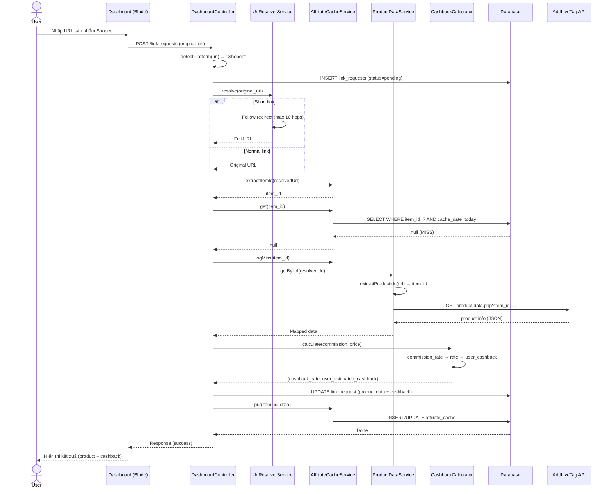
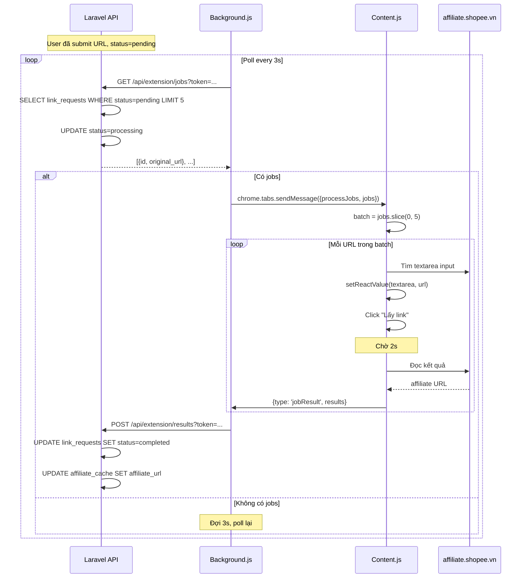
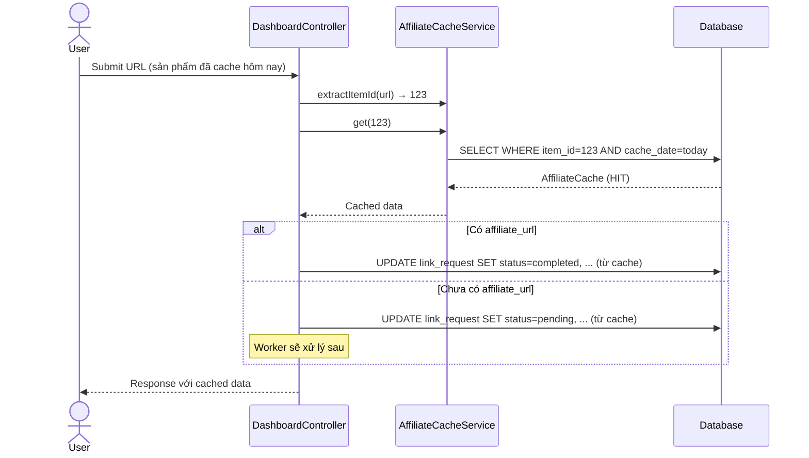
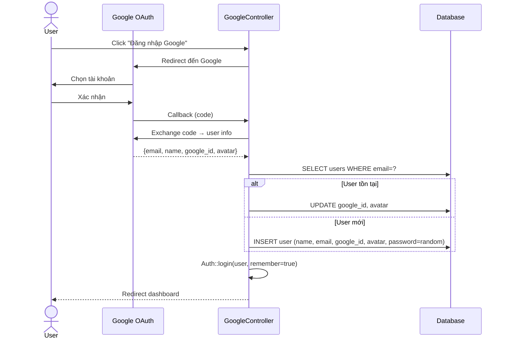
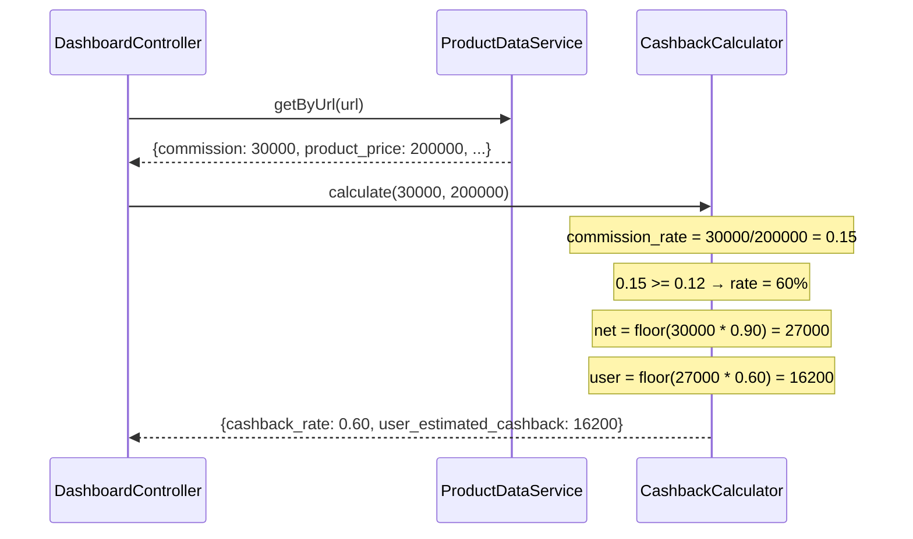
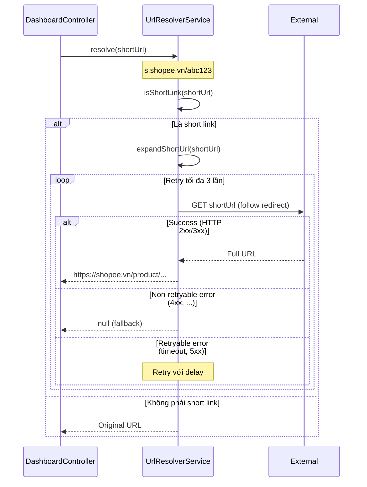
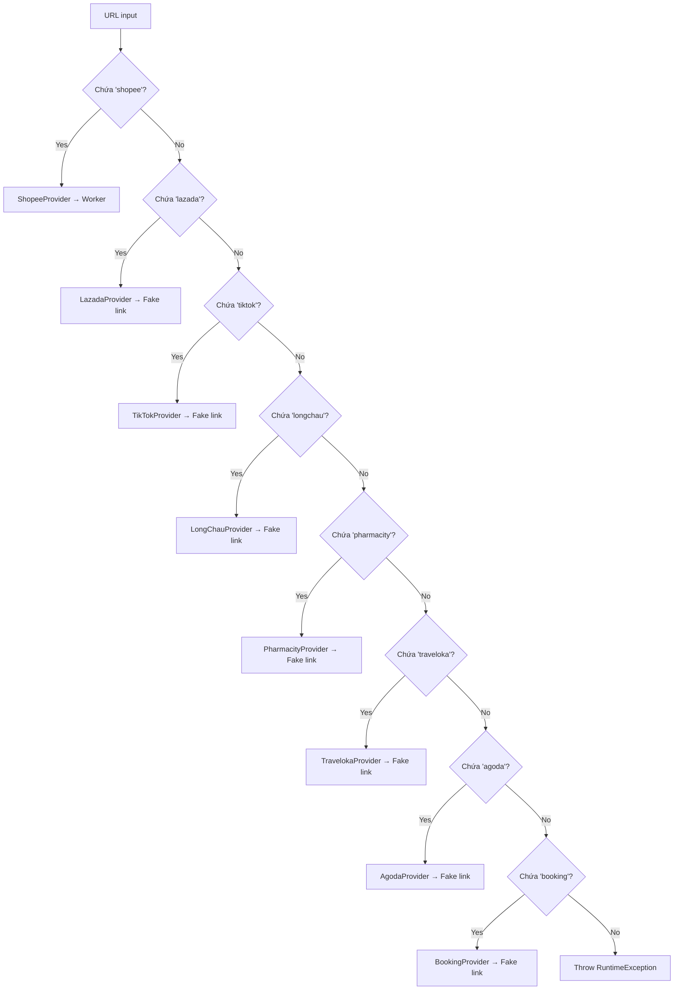
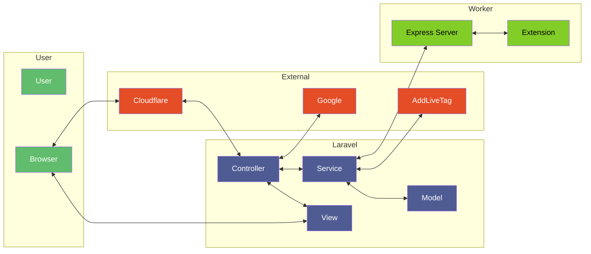

# Sequence Diagrams

## 1. Luồng tạo Affiliate Link (Cache MISS)

## 2. Luồng Worker (Browser Extension) — Tạo Affiliate Link

## 3. Luồng Cache HIT

## 4. Luồng Google Login

## 5. Luồng Cashback Calculation

## 6. Luồng URL Resolver

## 7. Luồng Provider Detection

## 8. Tổng quan luồng dữ liệu

