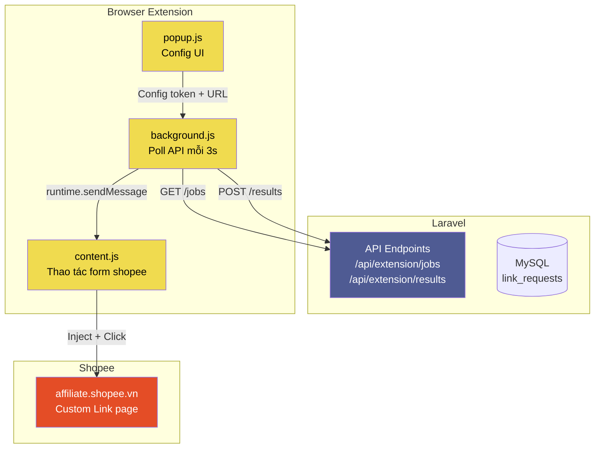

# Affiliate Worker

## Tổng quan

Hệ thống worker gồm 2 phần:
1. **Browser Extension (MV3)** — ✅ ĐANG DÙNG
2. **Playwright / CDP** — ❌ DEAD (Shopee chặn DevTools Protocol)

## Kiến trúc



## Browser Extension (MV3)

### File structure
```
affiliate-worker/browser-extension/
├── manifest.json
├── background.js
├── content.js
├── popup.html
├── popup.js
└── icons/
    ├── icon16.png
    ├── icon48.png
    └── icon128.png
```

### manifest.json
- **Manifest**: V3
- **Persistent background script**: `background.js`
- **Host permissions**: `https://hoantien.xyz/*`, `https://affiliate.shopee.vn/*`
- **Content script**: match `https://affiliate.shopee.vn/offer/custom_link*`

### background.js — Luồng hoạt động

```
Khởi tạo:
  → chrome.storage.local.get config (apiUrl, token, isRunning)
  → Nếu isRunning === true → startPolling()

Polling cycle (mỗi 3 giây):
  → GET {apiUrl}/api/extension/jobs?token={token}
  → Nếu có jobs:
    → Query tất cả tab (chrome.tabs.query)
    → Với mỗi tab:
      → chrome.tabs.sendMessage(tabId, {type: 'processJobs', jobs})
    → Xử lý timeout 15s
    → Nếu no response → ignore
  → Nếu response có jobs → tiếp tục
  → Nếu HTTP error hoặc empty → đợi 3s

Nhận kết quả từ content script:
  → Nhận message {type: 'jobResult', results: [...]}
  → POST {apiUrl}/api/extension/results?token={token}
  → body: {results: [{id, affiliate_url, status}]}
```

### content.js — Luồng hoạt động

```
Nhận message từ background:
  → {type: 'processJobs', jobs: [{id, original_url}]}

Xử lý (batch 5 URLs):
  → jobs.slice(0, 5) → process batch
  → Mỗi URL:
    1. Tìm textarea (input#react-select... hoặc [contenteditable])
    2. setReactValue(element, url) — set value + trigger React events
    3. Click button "Lấy link"
    4. Chờ 2s
    5. Lấy kết quả từ output element
    6. Push kết quả vào results array
  → Gửi kết quả về background

Hàm setReactValue(element, value):
  → const nativeInputValueSetter = Object.getOwnPropertyDescriptor(
      window.HTMLInputElement.prototype, 'value').set
  → nativeInputValueSetter.call(element, value)
  → element.dispatchEvent(new Event('input', {bubbles: true}))
  → element.dispatchEvent(new Event('change', {bubbles: true}))
  → element.dispatchEvent(new Event('blur', {bubbles: true}))

Phát hiện CAPTCHA:
  → Nếu location.href.includes('verify/captcha'):
    → Report status = 'captcha'

Phát hiện lỗi:
  → Không tìm thấy element → report error
  → Click không hiệu quả → report error
  → Output trống → report error
```

### popup.js — Configuration

```
Settings:
  → apiUrl: string (default: từ storage)
  → token: string (default: từ storage)
  → isRunning: boolean (toggle polling)

Display:
  → Status (running/stopped)
  → API status (connected/disconnected)
  → Last poll time
```

## Express Worker (server.js)

### Vai trò
HTTP API server chạy trên port 3001, phục vụ debug và test.

### Endpoints

| Method | Path | Mô tả |
|--------|------|-------|
| GET | /health | Health check, trả version + uptime |
| POST | /shopee/create-link | (Deprecated — CDP) Tạo link qua Playwright |
| GET | /playwright-test | (Deprecated) Test Playwright |
| GET | /shopee/profile-test | (Deprecated) Test Shopee profile |
| GET | /shopee/dashboard-test | (Deprecated) Test Shopee dashboard |
| GET | /shopee/session-test | (Deprecated) Test Shopee session |
| POST | /shopee-login | (Deprecated) Login Shopee |
| POST | /shopee-login-interactive | (Deprecated) Login interactive |

### server.js code
```javascript
const express = require('express');
const app = express();
const PORT = 3001;

app.use(express.json());

// Health check
app.get('/health', (req, res) => {
    res.json({ success: true, service: 'affiliate-worker', version: '1.0.0' });
});

// Shopee create link (CDP - deprecated)
app.post('/shopee/create-link', async (req, res) => {
    // Gọi CustomLinkWorker (CDP) — hiện tại trả về mock
    res.json({ success: false, error: 'CDP worker deprecated. Use Browser Extension instead.' });
});
```

## Playwright / CDP (Deprecated)

### Lý do deprecated
Shopee phát hiện Chrome DevTools Protocol (CDP) và force CAPTCHA.

### Các module deprecated

| File | Chức năng |
|------|-----------|
| `playwright/cdp/ChromeManager.js` | Quản lý Chrome instance + CDP connection |
| `playwright/cdp/AffiliateNavigator.js` | Điều hướng Shopee affiliate pages |
| `playwright/cdp/CustomLinkWorker.js` | Auto create custom link |
| `playwright/cdp/CustomLinkGenerator.js` | Generate custom link |
| `playwright/cdp/GraphQLMonitor.js` | Monitor GraphQL requests |
| `playwright/cdp/ModalParser.js` | Parse modal/popup |
| `playwright/cdp/SelectorFinder.js` | Find CSS selectors |
| `playwright/cdp/RecaptchaInterceptor.js` | Intercept reCAPTCHA |
| `playwright/browser.js` | Playwright browser setup + stealth |

### Failure modes
1. **CAPTCHA**: GraphQL response 200 nhưng body empty → redirect CAPTCHA
2. **Chrome not running**: ECONNREFUSED :9222 — port 9222 không mở

## Batch scripts

| Script | Mô tả |
|--------|-------|
| `start-worker.bat` | Chạy worker (production) |
| `start-worker-debug.bat` | Chạy worker (debug mode) |
| `start-chrome-cdp.bat` | Mở Chrome với remote debugging port 9222 |
| `start-affiliate-system.bat` | Khởi động toàn bộ hệ thống |
| `test-worker.bat` | Test kết nối worker |
| `create-link.bat` | Test tạo link thủ công |

## TODO
- [ ] Browser Extension cần filter tab theo đúng domain `affiliate.shopee.vn` (hiện tại gửi job đến ALL tabs)
- [ ] Content script cần verify element tồn tại trước khi thao tác
- [ ] Cần xử lý trường hợp Shopee session expire
- [ ] Retry mechanism cho failed jobs
- [ ] Rate limiting để tránh Shopee ban
- [ ] Popup cần force config load khi mở
