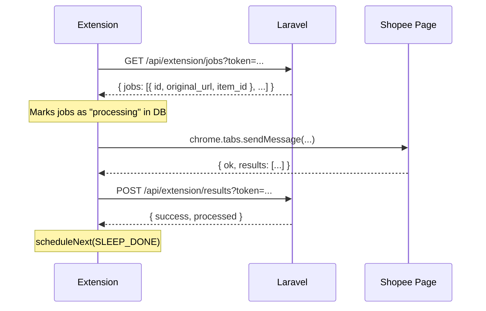

# Job/Queue System

## Overview

The project uses two distinct "queue" mechanisms:

1. **Laravel Dispatch (`afterResponse()`)** — For the AddLiveTag + CashbackCalculator async operation
2. **Browser Extension Polling** — For the Shopee affiliate link creation

## 1. Laravel afterResponse() Dispatch

### Location

`DashboardController@store` (lines 114-178):

```php
dispatch(function () use ($resolvedUrlClone, $itemIdClone, $linkId) {
    // ProductDataService + CashbackCalculator + LinkRequest update + Cache put
})->afterResponse();
```

### How It Works

- `dispatch(function() { ... })` pushes a closure to Laravel's queue system
- `->afterResponse()` configures it to execute AFTER the HTTP response is sent to the client
- The HTTP response is sent in ~50ms (vs ~730ms before the split)

### What the Closure Does

1. Calls `ProductDataService::getByUrl($url)` → fetches from AddLiveTag API
2. Extracts commission and price from response
3. Calls `CashbackCalculator::calculate($commission, $price)` → computes user cashback
4. Updates `LinkRequest` with all product data fields (item_id, shop_id, product_name, etc.)
5. Calls `AffiliateCacheService::put()` to populate the cache for future requests

### Queue Configuration

**No queue driver needed** — `afterResponse()` works with the sync queue driver. The closure runs during the kernel's `terminate()` phase.

If switched to a real queue driver (database, redis, sqs), the queue worker needs to run:
```bash
php artisan queue:work
```

### Failed Jobs

Failed queue jobs are stored in the `failed_jobs` table. View them:
```bash
php artisan queue:failed
php artisan queue:retry all
```

## 2. Browser Extension Polling

### Architecture

The extension acts as a polling consumer:



### Poll Intervals

| State | Delay | Location |
|-------|-------|----------|
| No jobs / disabled | 3000ms | `background.js:SLEEP_EMPTY` |
| Network error | 5000ms | `background.js:SLEEP_ERROR` |
| After posting results | 1000ms | `background.js:SLEEP_DONE` |

### Job States

| State | Description | Set By |
|-------|-------------|--------|
| `pending` | Waiting to be picked up | `DashboardController@store` |
| `processing` | Being processed by extension | `AffiliateJobController@jobs` |
| `completed` | Affiliate link created | `AffiliateJobController@result` |
| `failed` | Error during processing | `AffiliateJobController@result` |
| `rejected` | Manually rejected | Admin action |

## 3. Dashboard Polling

The dashboard uses a separate polling mechanism to check job status:

- **Endpoint:** `GET /api/link-request/{id}`
- **Client:** Alpine.js in `link-generator.blade.php`
- **Phases:** 300ms (0-3s) → 800ms (3-8s) → 2000ms (8s+)
- **Backoff:** Exponential on error, cap 5000ms
- **Stop conditions:** `completed`, `failed`, `rejected`, or user navigates away

## Comparison

| Aspect | afterResponse | Extension Polling | Dashboard Polling |
|--------|--------------|-------------------|-------------------|
| **Purpose** | Fetch product data + calculate cashback | Create Shopee affiliate short link | Show result to user |
| **Trigger** | Cache MISS | `pending` status in DB | User submits URL |
| **Frequency** | Once per unique product per day | Every 1-5s | Every 0.3-2s |
| **Mechanism** | Laravel dispatch | setTimeout chaining | Alpine.js setTimeout |
| **Failure mode** | Logged in failed_jobs table | Retries on next poll | Shows error to user |

## Job Lifespan (Complete Flow)

```
Time 0:      User submits URL
             DashboardController@store()
             → LinkRequest created (status: pending)
             → HTTP 200 response sent (~50ms)
             → afterResponse() dispatched

Time ~50ms:  Dashboard starts polling /api/link-request/{id}
Time ~730ms: afterResponse() runs
             → AddLiveTag API returns product data
             → LinkRequest updated with product fields
             → AffiliateCache populated
             → (status remains pending, no affiliate_url yet)

Time ~1-3s:  Extension polls GET /api/extension/jobs
             → Gets the job (status → processing)
             → Sends to content script

Time ~3-10s: Content script processes in Shopee tab
             → Fills form, clicks button, waits for result
             → Returns short link

Time ~3-10s: Extension POSTs results back
             → LinkRequest updated (affiliate_url, status: completed)
             → AffiliateCache.affiliate_url updated

Time ~3-10s: Dashboard poll detects "completed"
             → Shows affiliate link to user
```
